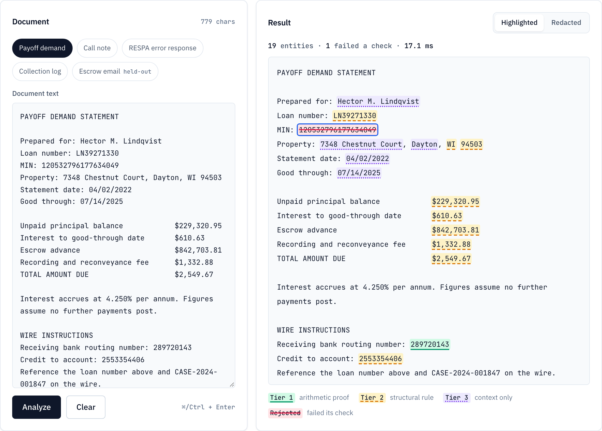
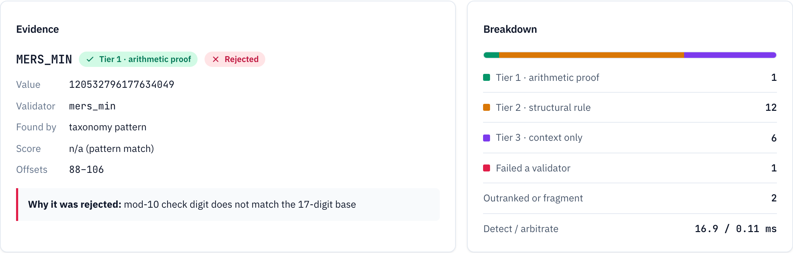
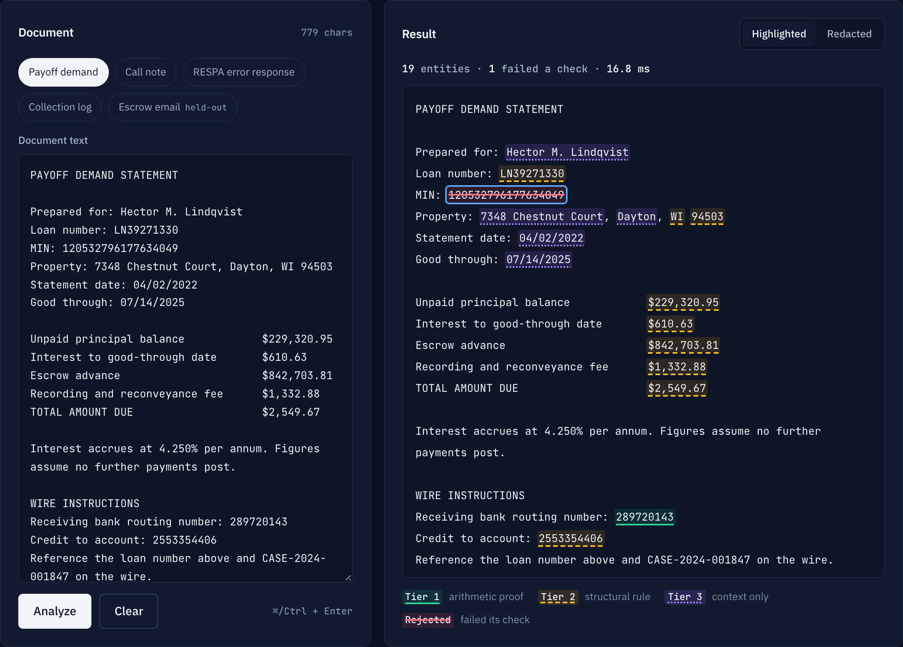
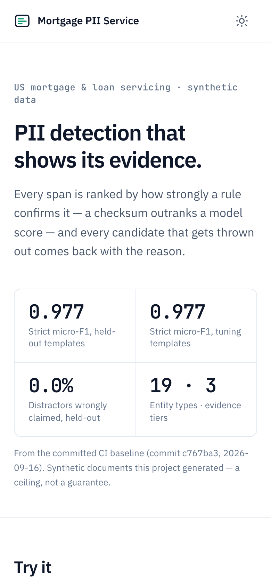

# Mortgage PII Service

PII detection and redaction for US mortgage and loan-servicing text, built so
that every decision is inspectable. Each span is ranked by **how strongly a rule
confirms it**, and every candidate that gets thrown out comes back with the
reason.

Most detection stacks break ties between overlapping spans by model confidence.
This one ranks by **evidence class**: a mod-10 checksum that holds outranks a
0.99 softmax, because one is arithmetic and the other is an opinion.



<sub>The rejected MERS MIN is struck through: its mod-10 check digit does not
match the 17-digit base. Underline style marks the tier — solid for arithmetic
proof, dashed for a structural rule, dotted for context only — so the page never
relies on colour alone.</sub>

---

## Results

Scored by `make eval` against two committed corpora and gated in CI on every
push. Strict matching means same type **and** identical character offsets.

| | Tuning templates | **Held-out templates** |
|---|---|---|
| Strict micro-F1 | 0.977 | **0.977** |
| Precision / recall | 0.982 / 0.972 | 0.981 / 0.974 |
| Relaxed micro-F1 (any overlap) | 0.979 | 0.982 |
| Macro-F1 across types | 0.970 | 0.980 |
| Distractors wrongly claimed | 2.6% of 264 | 0.0% of 150 |
| Near-misses redacted under another label | 11 of 161 | 15 of 149 |
| Documents · labelled spans | 120 · 2,376 | 120 · 2,070 |

**Why two splits.** Every detection rule — the context window, the gating word
lists, the arbitration order — was tuned on documents built from the ten
*tuning* templates. Reporting only on those would be grading the rules on the
phrasing they were fitted to. The *held-out* documents come from four templates
written before any result on them was seen and never used for tuning: a
borrower's first-person hardship letter, an escrow email thread with a quoted
reply, a bankruptcy referral memo, and a title curative note. They are
report-only; changing a rule because of a held-out number would make it a second
development set.

**What the numbers are not.** The corpus deliberately contains *near-misses* —
values that pass a type's pattern and fail its validator, like a routing number
one digit off its checksum. Near-miss rejection is 100% on both splits, and that
is **true by construction**: the generator only emits values a test proves the
validator rejects. It verifies wiring, so it isn't reported above as a score.
The informative numbers are the ones the generator does not control: how often
PII-shaped *distractors* (interest rates, CFR citations, form numbers) get
claimed, and how many rejected near-misses were still redacted under a different
label.

<details>
<summary>Per-type strict F1 (bold: below 0.90)</summary>

| Type | Tier | Tuning F1 | Held-out F1 | Support |
|---|---|---|---|---|
| `ABA_ROUTING` | 1 | 1.000 | 0.990 | 39 / 47 |
| `CREDIT_CARD` | 1 | 1.000 | 1.000 | 22 / 26 |
| `MERS_MIN` | 1 | 1.000 | 1.000 | 49 / 47 |
| `SSN` | 1 | 0.952 | 1.000 | 20 / 46 |
| `EIN` | 2 | 1.000 | 1.000 | 31 / 55 |
| `EMAIL` | 2 | 1.000 | 1.000 | 104 / 118 |
| `ITIN` | 2 | 1.000 | 0.980 | 11 / 25 |
| `LOAN_NUMBER` | 2 | 0.933 | **0.821** | 108 / 95 |
| `MONEY` | 2 | 1.000 | 1.000 | 241 / 181 |
| `NMLS_ID` | 2 | 0.937 | 1.000 | 52 / 22 |
| `PHONE` | 2 | 1.000 | 1.000 | 114 / 110 |
| `US_ACCOUNT_NUM` | 2 | **0.778** | 0.941 | 38 / 57 |
| `US_STATE` | 2 | 1.000 | 1.000 | 132 / 83 |
| `ZIP` | 2 | 0.995 | 1.000 | 102 / 49 |
| `CITY` | 3 | **0.877** | 0.956 | 132 / 90 |
| `CREDIT_SCORE` | 3 | 1.000 | — | 24 / 0 |
| `DATE` | 3 | 1.000 | 0.999 | 360 / 330 |
| `PERSON_NAME` | 3 | 0.961 | 0.948 | 240 / 300 |
| `STREET_ADDRESS` | 3 | 1.000 | 1.000 | 132 / 90 |

Full report, including relaxed F1 and in-process latency: [`evaluation/baseline.json`](evaluation/baseline.json).

</details>

---

## The tiers

Tier means **strength of evidence that a span is a true instance of its type** —
not what kind of detector produced it. A tier-3 entity may come from a regex; a
tier-2 entity may come from a model.

| Tier | Meaning | Types |
|---|---|---|
| **1** — arithmetic proof | A checksum or issuing rule can prove the value impossible | `SSN` `ABA_ROUTING` `CREDIT_CARD` `MERS_MIN` |
| **2** — structural rule | A deterministic rule rejects values the pattern accepts | `EIN` `ITIN` `PHONE` `EMAIL` `ZIP` `US_ACCOUNT_NUM` `LOAN_NUMBER` `NMLS_ID` `US_STATE` `MONEY` |
| **3** — context only | No rule can confirm it; the evidence is the surrounding text | `PERSON_NAME` `STREET_ADDRESS` `CITY` `DATE` `CREDIT_SCORE` |

Tier-1 rules are not equally strong, and the design accounts for it. Luhn
rejects about 90% of digit strings; the SSA's issuing rules reject about a
quarter. That is why `SSN` is context-gated despite being tier 1 — ungated, it
claimed every routing and account number on the page, at precision 0.164.

## How it works

```
document
   │
   ├─ taxonomy scanners        regexes from taxonomy/entities.yaml, permissive on purpose,
   │                           context-gated where a pattern alone is too broad
   ├─ spaCy NER via Presidio   PERSON and LOCATION only
   ▼
candidates ─▶ validate ─▶ arbitrate ─▶ entities[] + dropped[] with reasons ─▶ redact
```

Arbitration precedence is tier, then span length, then context-word proximity,
then score, then declaration order — a total order, because a frozen evaluation
set whose diffs shuffle is not a regression gate. A candidate that fails its
validator leaves contention entirely instead of shadowing a weaker reading of
the same characters. Three orderings were measured; this one won.



**Presidio is candidate generation only.** Its registry is trimmed to the spaCy
recognizer and its own arbitration is unused: `validate_result()` returns a bool
and deletes the loser — no tier, no reason, no rejected candidate — which would
erase what this project exists to show. Its stock output on one servicing
sentence also includes `US_SSN` at 0.4 with no SSA arithmetic, `DATE_TIME` over a
credit card number, and `ORGANIZATION` over the literal word "SSN". A test
asserts none of it reaches arbitration.

---

## Quickstart

```bash
make install        # .venv, dev dependencies, spaCy en_core_web_md
make test           # 267 tests
make serve          # API + demo at http://localhost:8000
make eval           # score both splits, per-type table
```

`make help` lists the rest: `eval-check` (the CI gate), `baseline`, `corpus`,
`check-corpora`, `samples`, `screenshots`.

Container — the spaCy model is baked in at build time, so it must start with no
network at all:

```bash
docker build -t mortgage-pii .
docker run --network none -p 8000:8000 mortgage-pii
```

CI builds and starts it this way on every push: 546 MB, ready 3 s after a cold
start with networking disabled.

## API

| Method | Path | Returns |
|---|---|---|
| `POST` | `/v1/detect` | Entities, discarded candidates with reasons, per-tier counts, per-stage timings |
| `POST` | `/v1/anonymize` | The above plus the redacted document |
| `GET` | `/v1/taxonomy` | Entity types, tiers, validators |
| `GET` | `/v1/evaluation` | The committed evaluation baseline |
| `GET` | `/healthz` · `/readyz` | Liveness (touches nothing) · readiness (fails until the model is warm) |

Interactive docs at `/docs`. Every detection response carries the taxonomy
version, engine identity, a request id, per-stage timings and the validator
rejection rate, and is sent with `Cache-Control: no-store` because it echoes the
submitted document.

## The demo page

One static page, no build step, no third-party requests: fonts (IBM Plex Sans,
JetBrains Mono, both SIL OFL) are self-hosted so it works behind a restrictive
network. A strict Content-Security-Policy forbids inline script and style, and
the script never parses submitted text as HTML — it renders pasted content, so
the CSP is the backstop if escaping is ever got wrong.

Checked with axe-core against WCAG 2.2 AA in both themes (0 violations), and by
hand for keyboard use: every highlighted span is focusable and opens its
evidence on Enter. Samples are chosen by running the pipeline, so each one shows
at least one tier-1 proof and one rejection.

<p>


</p>

---

## Limitations

**The numbers describe synthetic data this project generated.** They are a
ceiling, not a guarantee. The corpus embodies assumptions about how servicing
documents are written, and nothing here has been run against a real servicing
file.

**The held-out split is weaker than it could be.** The same person wrote the
detection rules and the held-out templates, and knew the context-word lists when
writing them. Templates written by someone who had not read the rules would be a
harder and more honest test.

**Per-type results move between splits more than the aggregate does.**
`LOAN_NUMBER` recall falls to 0.747 on held-out phrasing; the loan number
pattern has no industry format and depends on nearby context words.
`US_ACCOUNT_NUM` is 0.778 on the tuning split because tier outranks context: a
bare nine-digit account number that happens to satisfy the SSA's rules is
labelled `SSN`. The span is still redacted, so the privacy outcome holds, but the
label is wrong. `CITY` recall is 0.811 there — spaCy misses cities rather than
mislabelling them.

**Name boundaries are the soft spot of the model-carried types.** Held-out
`PERSON_NAME` is 0.948 strict but 0.978 relaxed: the names are found, and the
edges are drawn wrong.

**Detection is format-dependent in ways the corpus does not fully punish.**
`DATE` matches numeric dates only, so "the fifteenth of March" is missed, and
neither corpus contains prose dates — `DATE`'s near-perfect F1 overstates
real-world performance. `PHONE` requires visible formatting. `SSN` requires a
nearby label, so an unlabelled SSN in a bare table column is missed.

**`MERS_MIN` carries more specification risk than its siblings.** There is no
convenient public corpus of known-good MINs, so generator and validator could in
principle share a misreading. They are written to be independent — the generator
constructs check digits forward and never calls the validator — but that is a
mitigation, not a proof.

**Not yet measured:** HTTP throughput under concurrency, cost per 1,000
documents, and drift. The latency in the report is in-process, one document at a
time, on one laptop — not a service benchmark. The accessibility audit is
automated plus a keyboard check; it has not had a screen-reader pass.

**Two arbitration edge cases leave characters unredacted.** A reading that
loses a *partial* overlap is dropped whole, so its characters outside the
winner stay in the output; how often that happens has not been measured. And a
valid value inside a longer match that itself lost an overlap is dropped with
it — none of the 133 such fragments in either corpus is in that position, but
real text could be. Both are recorded in `DECISIONS.md` (2026-10-03).

**Arbitration is quadratic in the number of candidates.** A crafted 199 KB
document takes 4.7 s, within the 200 KB request limit, so a public deployment
needs that fixed or a tighter limit first.

**The container is built only in CI**; the development machine has no Docker.
At 546 MB it is over the 400 MB target set at the start, and where the size goes
has not been broken down yet.

English, US, one locale.

---

## Data provenance

**All data is synthetic.** Generated locally by `synth/` from committed
templates; no real borrower record has ever been in this repository. Identifiers
are structurally valid and randomly generated with no linkage to any person.
Phone numbers use the 555-0100–555-0199 range reserved for fictional use, email
domains are RFC 2606 reserved, and card numbers build on published processor test
prefixes. Both committed corpora regenerate byte-for-byte from their manifests,
and CI checks that they still do.

## Layout

```
taxonomy/entities.yaml     19 types: tier, pattern, validator, examples. One source of truth for
                           validation, generation, the evaluation label set and the drift bins
app/validate/              checksums.py (tier 1) · structural.py (tier 2)
app/detect/                taxonomy scanners · Presidio behind a Protocol
app/core/                  arbitration · anonymisation · pipeline · types
app/web/static/            the demo page, with self-hosted fonts
synth/                     generator · templates/ (tuning) · templates_holdout/
evaluation/                scoring, the baseline gate, baseline.json
data/corpus/               frozen (tuning) and holdout corpora, committed with manifests
tests/                     267 tests; fixtures/ holds externally sourced validator vectors
tools/                     corpus check · sample picker · screenshot capture
```

Validators are tested against **externally sourced** vectors — published Federal
Reserve routing numbers, published processor test cards, the SSA's never-issued
ranges, the IRS unassigned prefix table — rather than values this project
generates. If a validator's only evidence were the project's own generator, a
shared misreading of a specification would be invisible in both.

See [DECISIONS.md](DECISIONS.md) for why things are the way they are.
